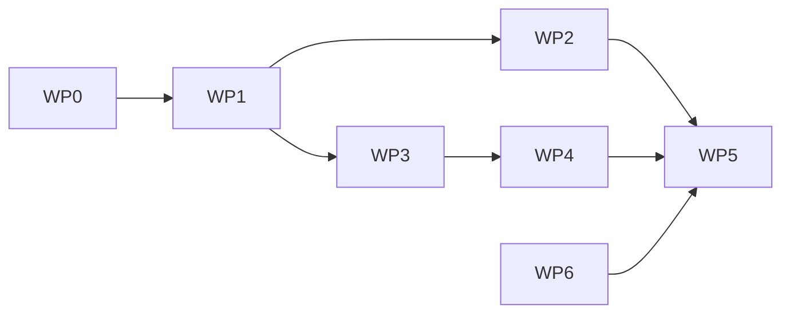

# EUDI Wallet Verifier Kit: Framework-Agnostic by Design

## Project Overview

**Project:** `eudi-verify` — open-source, framework-agnostic EUDI Wallet *verifier* kit (captcha-style `<eudi-verify>` widget + REST API + OpenAPI), built on `@openeudi/*` behind a swappable `VerifierEngine` interface. Apache-2.0. EU-sovereignty constraints: no US proprietary services, no Lit/React in core, pnpm workspaces (no Turborepo).

**Key decisions (settled):** name `eudi-verify`; vanilla Custom Elements (no Lit); html-vanilla + Node reference demo (Next deferred); all-public monorepo; Sphereon OID4VC as documented engine fallback; theming = 6 CSS vars via open Shadow DOM.

---

## Work Package Breakdown

**Execution model:** Contracts first, then independent packages implemented against acceptance criteria in `docs/wp/WPn.md`. WP1 is the keystone — everything else codes against its artifacts.

### MVP Scope

Four core artifacts only. React/Next/Hono bindings, Auth.js, Vue example, and production HAIP are **deferred to a later phase**.

### WP0 — Scaffold ✓

- pnpm workspaces: `packages/{server,client,embed}`, `openapi/`, `examples/html-vanilla/`
- TS strict, Vitest, GitHub Actions (test + license allowlist: Apache-2.0/MIT/BSD/ISC), Apache-2.0 LICENSE, README stub
- **Accept:** `pnpm install && pnpm test` green in CI

### WP1 — Contracts (keystone) ✓

- `openapi/eudi-verifier.yaml` (OpenAPI 3.1): `POST /sessions`, `GET /sessions/:id`, `POST /sessions/:id/cancel`, `POST /tokens/verify` (+ stubs for prod `POST /callback`, `GET /request/:id`)
- `packages/server/src/engine.ts`: **`VerifierEngine` interface** — `createSession`, `getSession`, `handleCallback`, `cancelSession`. OpenEUDI is impl #1; Sphereon OID4VC is the documented fallback
- Shared types: `VerificationRequest` (`{ age_over_18?: true, nationality?: true }`), `SessionStatus`, `VerificationToken` (`eudi_v1.<b64url payload>.<hmac>`, single-use, 5-min TTL, key-id field for rotation)
- `IKVStore` interface (memory impl now; Redis later)
- **Accept:** spec lints (spectral); types compile; engine interface has doc comments + mock impl for tests

### WP2 — Server (`@eudi-verify/server`)

- Framework-agnostic handler factory implementing the OpenAPI spec; demo mode via `OpenEudiEngine` wrapping `@openeudi/core` DemoMode
- Token mint/verify (HMAC, constant-time compare, single-use via IKVStore), per-IP rate limit on `POST /sessions`, Origin check, loud demo-mode warnings (console + `X-Eudi-Mode: demo` header)
- **Accept:** contract tests vs OpenAPI spec pass; token replay/forgery/expiry unit tests pass; engine swappable via mock

### WP3 — Client (`@eudi-verify/client`)

- Vanilla TS, zero deps (QR via small vendored/audited lib): typed API client from OpenAPI, `createVerification()` → state machine (`idle→loading→showQR→waitingForWallet→verified|rejected|expired`), polling with exponential backoff (SSE later)
- **Accept:** unit tests with mocked fetch; bundle <15KB gzip; no framework imports

### WP4 — Embed (`@eudi-verify/embed`)

- `<eudi-verify>` vanilla Custom Element over WP3; open Shadow DOM; 6 CSS vars (`--eudi-primary/text/background/border-radius/font-family/error`); attrs `api-url`, `request`; events `verified` (detail.token), `rejected`, `expired`, `error`
- WCAG 2.1 AA: focus, ARIA live status, contrast-safe EU-institutional defaults
- **Accept:** works in plain HTML; theming via CSS vars only; Playwright e2e against WP2 demo server; axe-core clean

### WP5 — Demo + Deploy

- `examples/html-vanilla`: static page + ~50-line Node server mounting WP2 handlers; age-gate form gated on `POST /tokens/verify`
- `docs/deploy-eu.md`: Docker Compose + Hetzner walkthrough; live demo URL
- **Accept:** clone-to-verified <10 min; live URL up

### WP6 — Security Docs

- `THREAT_MODEL.md`, `SECURITY.md` (disclosure policy), `DEPENDENCY.md` (license/origin per dep)
- **Accept:** docs exist; CI license gate enforced; demo labeled not-production everywhere

### Dependency Order



WP2 and WP3 parallelize after WP1. WP6 can run anytime.

---

## Core Principle: Framework Agnostic

The **product** is not a React or Next library. It is three stack-independent layers:

| Layer               | Package                                | Who uses it                                   |
| ------------------- | -------------------------------------- | --------------------------------------------- |
| **1. Verifier API** | `@eudi-verify/server` + OpenAPI spec   | Any backend — Node, PHP, Python, Java         |
| **2. Embed widget** | `@eudi-verify/embed` (`<eudi-verify>`) | Any frontend — Vue, WordPress, plain HTML     |
| **3. Client logic** | `@eudi-verify/client` (vanilla TS)     | Shared by embed + optional framework bindings |

**Optional bindings** (convenience, not the product):

- `@eudi-verify/react` — thin wrapper for React apps
- `@eudi-verify/next` — route handler adapter for demo/docs
- `@eudi-verify/hono` — portable Node API mount

---

## Sovereignty & Dependency Policy

**Goal:** No US **proprietary** software or hosted middleware. Self-hosted, auditable, open-source digital commons.

### Core Stack (sovereign-by-design)

| Component             | Choice                                       | Sovereignty note                                        |
| --------------------- | -------------------------------------------- | ------------------------------------------------------- |
| Protocol engine       | `@openeudi/core` + `@openeudi/openid4vp`     | **Apache-2.0, built in Luxembourg** — anchor dependency |
| Verifier API          | `@eudi-verify/server`                        | Self-hosted, EU deploy                                  |
| Widget                | `<eudi-verify>` **vanilla Custom Elements**  | **No Lit/Google** — zero framework dep in embed         |
| Client logic          | `@eudi-verify/client` (vanilla TS)           | No React required                                       |
| API contract          | OpenAPI 3.1                                  | Standard, implementation-agnostic                       |
| Reference API adapter | Hono (MIT, JP author) or Node `http`         | Portable, no Vercel requirement                         |
| Session store         | `IKVStore` interface — memory/Redis/Postgres | Self-hosted EU Redis/Postgres                           |
| Demo hosting          | **Hetzner / EU VPS** (or self-host)          | Document EU deployment, not Vercel-as-default           |
| Monorepo              | **pnpm workspaces** (not Turborepo)          | Avoid Vercel-tooling association; keep build simple     |

---

## Dependencies & Risk Mitigation

### Protocol Implementation

This project wraps third-party OpenID4VP implementations behind a swappable `VerifierEngine` interface:

| Engine | Origin | Status | Risk |
|--------|--------|--------|------|
| `@openeudi/core` | Luxembourg | **Primary** | Single maintainer (bus factor) |
| Sphereon OID4VC | Netherlands | Fallback | Company-backed, heavier |
| MockEngine | This project | Testing | No real verification |

**Mitigation:** The `VerifierEngine` interface isolates protocol details. If `@openeudi/core` becomes unmaintained:
1. Patch locally (Apache-2.0 allows this)
2. Swap to Sphereon with minimal code changes
3. Fork and maintain (last resort)

### EU Infrastructure Status

The EU Digital Identity Wallet ecosystem is still being built:

| Component | Status | Impact |
|-----------|--------|--------|
| eIDAS 2.0 Regulation | ✅ Passed | Legal framework exists |
| Architecture Reference Framework | ✅ Published | Specs available |
| EU Reference Wallet | 🟡 Development | Can't test against real wallet |
| National Wallet Apps | 🟡 Pilots only | Limited availability |
| EU Trust List (production) | 🔴 Not live | Can't verify real credentials |

**Consequence:** Demo mode only for now. Production verification requires EU infrastructure that doesn't exist yet.

---

## Security: Threat Model Summary

### Trust Boundaries

- **Never trust:** Browser/Widget, Wallet UI claims shown to user
- **Trust only after verify:** `@eudi-verify/server`, `@openeudi/openid4vp`, Merchant server `verifyEudiToken`

### Verification Token Design (captcha pattern)

```
eudi_v1.<base64url(payload)>.<hmac>
payload = { sessionId, claimsHash, exp, singleUse: true }
```

### Key Mitigations

| Threat                       | Mitigation                                                                                |
| ---------------------------- | ----------------------------------------------------------------------------------------- |
| Client fakes verified claims | Widget returns opaque token only; merchant server calls `/tokens/verify`                  |
| Token replay                 | Single-use tokens, short TTL (5 min), bound to sessionId                                  |
| Token forgery                | HMAC signed with server `VERIFICATION_SECRET`; constant-time compare                      |
| Session fixation             | Bind session to redirect, validate state/nonce/key-binding JWT                            |
| CSRF on session create       | Same-origin policy on widget API; Origin/Referer checks                                   |
| Abuse / DoS                  | Rate limit `POST /sessions` and `POST /callback` per IP; session TTL cleanup              |

---

## Widget Model

The user-facing product is a **captcha-style identity verification widget**:

| reCAPTCHA / Turnstile                    | EUDI Widget                                                 |
| ---------------------------------------- | ----------------------------------------------------------- |
| Embed captcha on checkout form           | Embed `<eudi-verify request='{"age_over_18":true}'>`        |
| User solves challenge                    | User scans QR / approves in wallet app                      |
| Widget yields `captchaToken`             | Widget yields `eudiVerificationToken` (opaque, short-lived) |
| **Your server** calls Google/CF to verify| **Your server** calls `/tokens/verify` on verifier API      |

### Theming: 6 CSS Variables via Open Shadow DOM

| Theme token            | Purpose                |
| ---------------------- | ---------------------- |
| `--eudi-primary`       | Button, success accent |
| `--eudi-text`          | Body text              |
| `--eudi-background`    | Widget surface         |
| `--eudi-border-radius` | Corner rounding        |
| `--eudi-font-family`   | Typography match       |
| `--eudi-error`         | Rejected state         |

---

## Contributor Handoff

Each work package has a brief in `docs/wp/WPn.md` with acceptance criteria. Implement against WP1 contract files (`openapi/eudi-verifier.yaml`, `packages/server/src/{types,store,engine}.ts`).

**Review gates** (human review before merge):

- WP1: contract changes
- WP2: token/security code
- WP4: accessibility (WCAG 2.1 AA)
