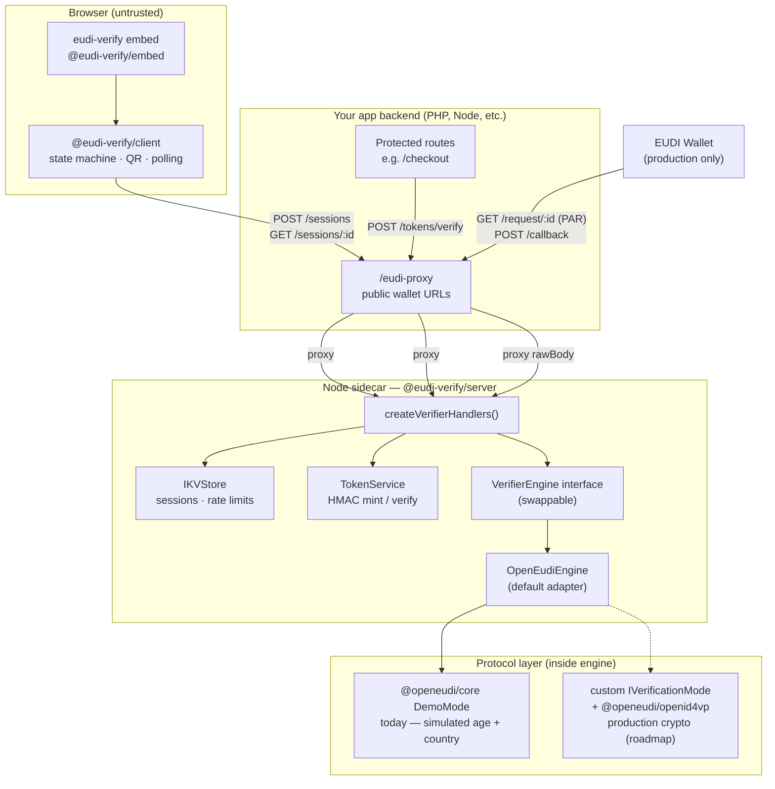
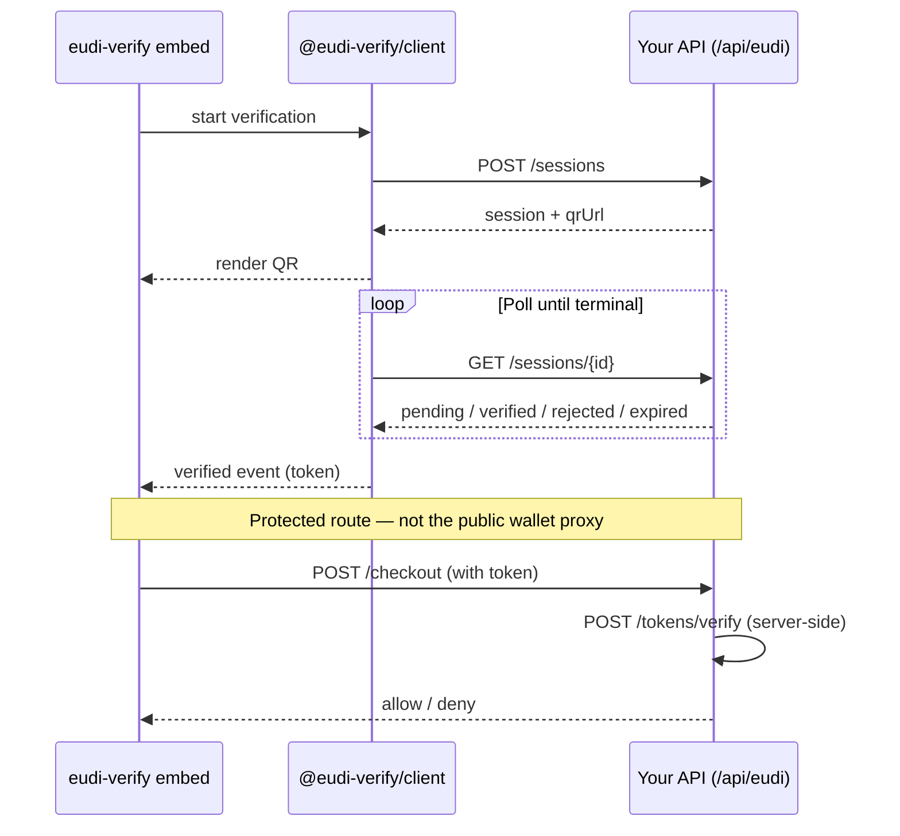
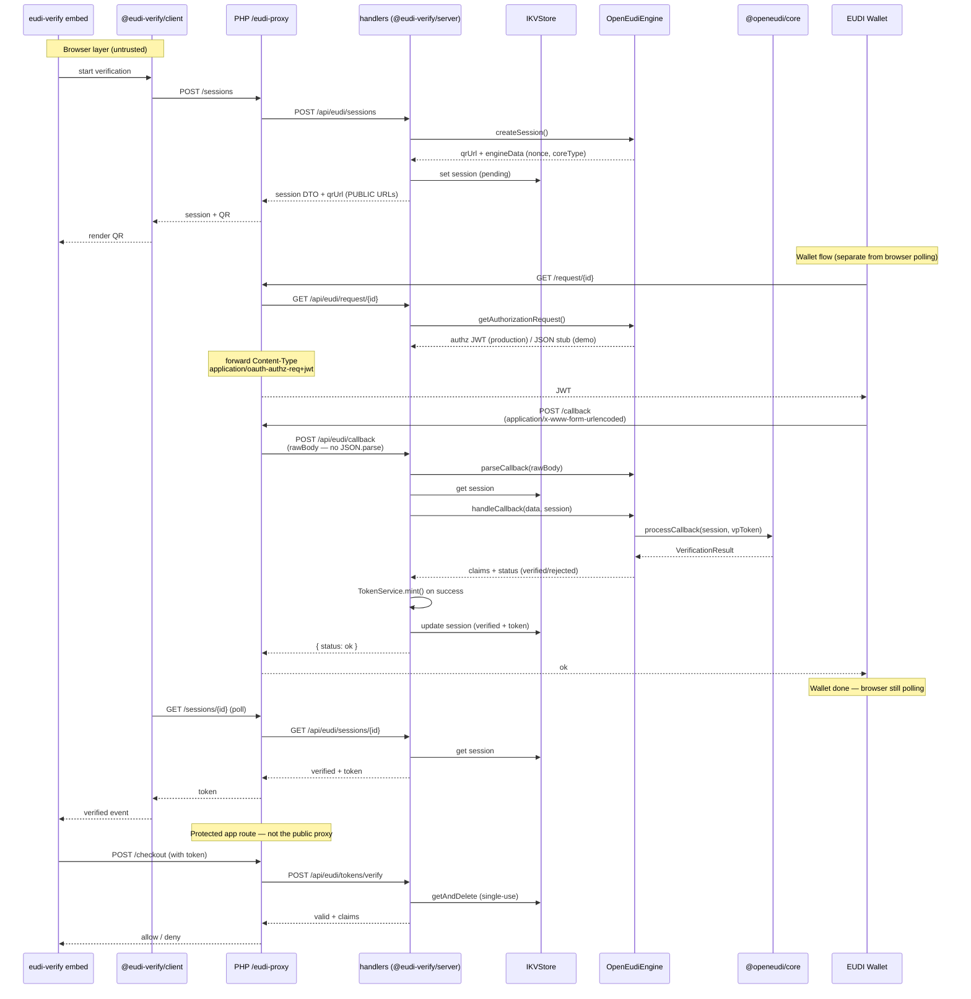
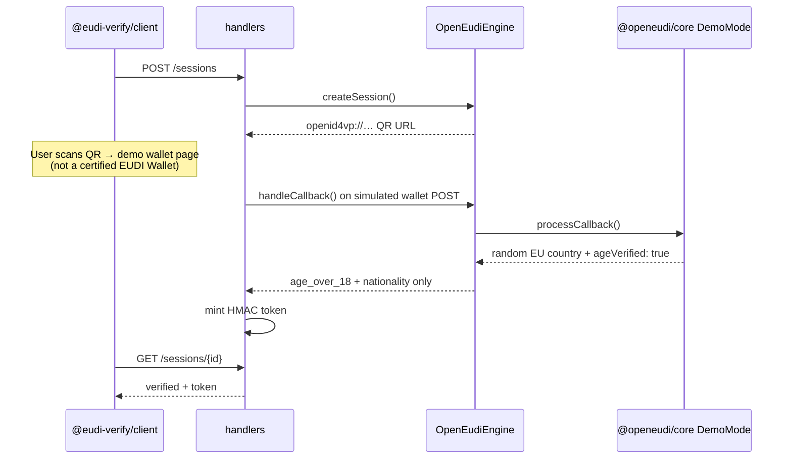

# Integration architecture

How `eudi-verify` layers fit together — from the browser widget to `@openeudi/core`.

**See also:** [Integration guide](./INTEGRATION.md) (quick start), [OpenAPI spec](../openapi/eudi-verifier.yaml), [ARF alignment](./ARF_ALIGNMENT.md).

---

## Overview

`eudi-verify` is three browser packages plus a Node handler library. Session lifecycle and tokens are owned by `@eudi-verify/server` (`IKVStore` + handlers). The pluggable `VerifierEngine` interface wraps a protocol strategy — today `@openeudi/core` `DemoMode` inside `OpenEudiEngine`.

**PHP and other non-Node backends:** implement the [OpenAPI contract](../openapi/eudi-verifier.yaml) in your language, or run a **Node sidecar** that mounts `@eudi-verify/server` and proxy wallet-facing URLs through your public origin ([production flow](#production-flow-php-proxy--node-sidecar)).

---

## Component diagram (embed → engine)

---

## Layer responsibilities

| Layer             | Package                         | Owns                                                |
| ----------------- | ------------------------------- | --------------------------------------------------- |
| Widget UI         | `@eudi-verify/embed`            | DOM, accessibility, custom events                   |
| Client logic      | `@eudi-verify/client`           | QR generation, polling, state machine               |
| API handlers      | `@eudi-verify/server`           | Sessions, rate limits, wallet callbacks, token mint |
| Session store     | `IKVStore` (in server)          | Session lifecycle — not `@openeudi/core`'s store    |
| Engine seam       | `VerifierEngine`                | Swappable protocol adapter                          |
| Protocol strategy | `@openeudi/core` `DemoMode`     | Credential simulation (demo today)                  |
| Production crypto | `@openeudi/openid4vp` (roadmap) | VP parsing and signature verification               |

The engine interface is the portability seam: swap `OpenEudiEngine` for another `VerifierEngine` implementation without changing handlers, the widget, or your session store.

---

## Request flows

### Browser polling flow (all integrations)

The widget and client never trust verification outcomes until your backend validates the HMAC token.

### Production flow (PHP proxy + Node sidecar)

Use when your main app is PHP (or another stack) but wallet protocol handling runs in a Node sidecar. Wallet-facing URLs must be **public** on your origin; the sidecar can run on an internal port.

**PHP proxy checklist:**

- Forward `POST /callback` as **raw form body** — do not `json_decode` the wallet payload.
- Forward `GET /request/{id}` with the upstream `Content-Type` (`application/oauth-authz-req+jwt` in production).
- Expose **public** URLs in `qrUrl` and authorization requests (your CDN/origin hostname, not `localhost:3000` on the sidecar).
- Keep `POST /tokens/verify` on protected app routes (checkout), not on the open wallet proxy.

### Demo mode flow (today)

Demo mode does not exercise full wallet cryptography. `OpenEudiEngine` delegates to `@openeudi/core` `DemoMode`, which returns simulated **age over 18** and **country/nationality** only.

Requests for `age_over_21`, `given_name`, `family_name`, or `birth_date` are accepted at the API layer but those claims are **not returned** in demo mode until a production engine path exists.

---

## Trust boundaries

| Component                  | Trusted? | Notes                                                          |
| -------------------------- | -------- | -------------------------------------------------------------- |
| Browser / widget           | No       | Can start verification; cannot assert verified claims          |
| Verifier API (your server) | Yes      | Owns sessions, callbacks, token signing, replay protection     |
| EUDI Wallet                | External | Validated via OpenID4VP / trust framework (production roadmap) |
| Your checkout route        | Yes      | Must call `POST /tokens/verify` — never trust the widget alone |

See [Error handling](./integration-errors.md) for how failures surface at each layer.
